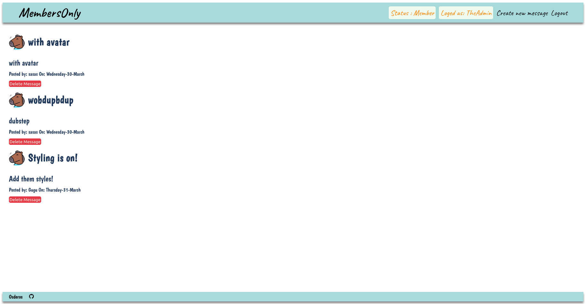

# Members Only App

Preview -> [Check it out]()

## Summary :
In the members only app i have applied the user authentification with PassportJS. The app opens with the main page that displays all the members posts. The visitor can see the message title and content but has to sign-up or login in to post a message. After user logs in it is possible to become a member by answering a riddle. Members can see who posted the messages and at what date. It is also possible for the user to pick admin right when signing up. Admin rights allow the user to delete posts.

## Technologies used :

### Backend:
- Node with Express
- JS
- MongoDB with Mongoose
- Passport for authentication

### Frontend:
- HTML
- CSS
- EJS

### Mentions:

[Horse icons created by Freepik - Flaticon](https://www.flaticon.com/free-icons/horse)
[Festivity icons created by Freepik - Flaticon](https://www.flaticon.com/free-icons/festivity)
[People icons created by Freepik - Flaticon](https://www.flaticon.com/free-icons/people)
